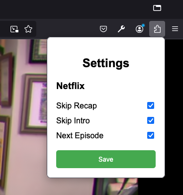

# Skippy - Netflix Skip Extension

  

## Overview

**Skippy** is a lightweight browser extension that enhances your Netflix viewing experience by automatically skipping intros, recaps, and seamlessly transitioning to the next episode without waiting for Netflix’s built-in countdown. No more interruptions or the hassle of manually clicking “Skip” buttons—Skippy does it all for you!

With Skippy, you can customize which elements to skip:

- **Skip Intro:** Automatically skips the intro of any episode.
- **Skip Recap:** Jumps past episode recaps so you can get right into the new content.
- **Skip to Next Episode:** Skips to the next episode as soon as the current one ends, eliminating the standard 5-second countdown.

## Features

- **Automatic Control:** Skippy automatically detects and interacts with Netflix’s “Skip” buttons using a Mutation Observer to monitor changes in the DOM, making it more efficient compared to extensions that rely on continuous timeouts.
- **Customizable Options:** Toggle on/off specific features from the popup menu, allowing you to control exactly what Skippy skips.
- **Cross-Browser Compatibility:** Developed primarily for Firefox but is also compatible with other Chromium-based browsers like Chrome and Edge.
- **Future Marketplaces Support:** Once polished, Skippy will be available in browser extension marketplaces for easy installation and updates.

## Technical Details

Skippy uses a **MutationObserver** to efficiently monitor the Netflix webpage for the appearance of “Skip” buttons and interact with them when necessary. Unlike other extensions that rely on set timeouts or intervals, MutationObservers react immediately to changes in the DOM, making Skippy faster and potentially more resource-efficient.

## Installation

### Firefox

1. Clone or download this repository to your local machine.
2. Open Firefox and go to `about:debugging`.
3. Click on **This Firefox** in the sidebar.
4. Click **Load Temporary Add-on...** and select the `manifest.json` file in the folder containing this extension.
5. Skippy should now be installed and ready to use!

### Chrome/Edge

1. Clone or download this repository to your local machine.
2. Open Chrome or Edge and go to `chrome://extensions/`.
3. Enable **Developer mode** in the top right corner.
4. Click **Load unpacked** and select the folder containing this extension.
5. Skippy should now be installed and ready to use!

## Usage

Once the extension is installed:

1. Open Netflix and start watching any show or movie.
2. Click on the Skippy icon in your browser toolbar to open the settings popup.
3. Choose which elements you want Skippy to skip:
   - **Skip Intro**
   - **Skip Recap**
   - **Next Episode**
 
4. Skippy will now automatically handle these actions as you watch!

### Default Settings

By default, all options are turned **on**:

- **Skip Intro**
- **Skip Recap**
- **Next Episode**

## Future Enhancements

- **Support for Other Streaming Platforms:** Expand Skippy’s functionality to support other streaming services like Amazon Prime Video and Disney+.
- **Performance Optimization:** Optimize the current codebase for even better efficiency, ensuring smooth operation even with lower-spec devices or slow network connections.
- **Marketplace Release:** Submit Skippy to browser extension marketplaces like Firefox Add-ons, Chrome Web Store, and Edge Add-ons for easy installation and updates.
